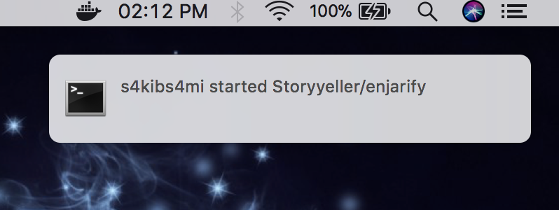

# gittivity
Mac desktop notifier for git browser activity



## Installation
Make sure you have `python` and `pip` install in your machine.
```
git clone https://github.com/s1s1ty/gittivity
```

## Quick Start

go to `gittivity` folder by running ``cd gittivity``

run `pip install -r requirements.txt --user`

##### For help

```
python notifier.py -h
```

#### Run
```
nohup python notifier.py <your_github_handle> [<setting>] &
```
<b>example: nohup python notifier.py s1s1ty & </b>

<b>Note :</b> setting is optional here, by default `n`

### what is setting?
If you want to get only your repo related notifications then put `y` otherwise `n`

###### NOTE: you don't get follow event notifications. Because github restricted it.

