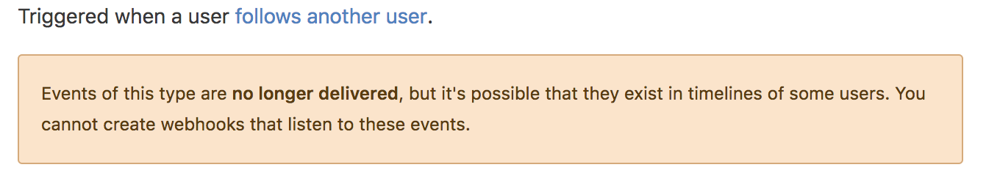

# gittivity
[](http://hits.dwyl.io/s1s1ty/gittivity)

Mac desktop notifier for git browser activity


## Installation
Make sure you have `python` and `pip` install in your machine.
```
pip install gittivity
```

## Quick Start

##### For help

```
gittivity
```

#### Run
```
nohup gittivity-start <your_github_handle> [<setting>] &
```
<b>example: nohup gittivity-start s1s1ty & </b>

<b>Note :</b> setting is optional here, by default `n`

### what is setting?
If you want to get only your repo related notifications then put `y` otherwise `n`

###### NOTE: you don't get follow event notifications. Because github restricted it.


### Stop gittivity

```
gittivity-stop
```

** If anyone want to contribute, please send me PR on my `development` branch.
